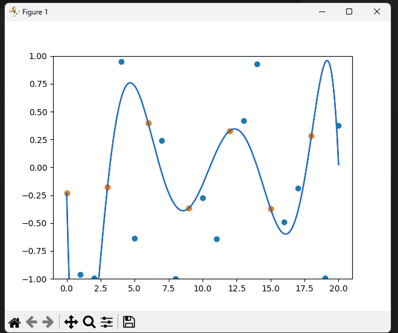
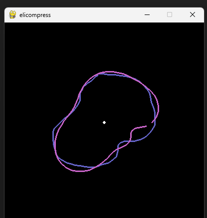
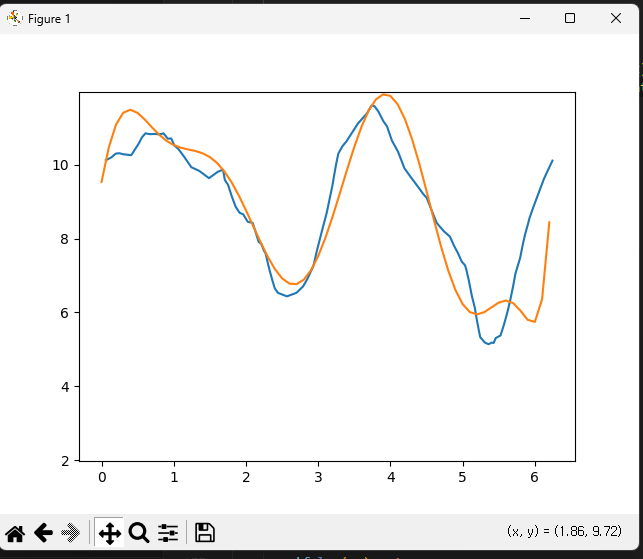

# elicompress
Polynomial elimination compression method

## Explanation
- It uses the polynomial elimination method and discrete gradient descent method developed by Lee Ji-hwan (smiilliin)
- More explanation will be added later.

## Images
Optimizing for gaussian noise

Optimizing for mouse-drawn image

Optimizing for PCM_16 data

